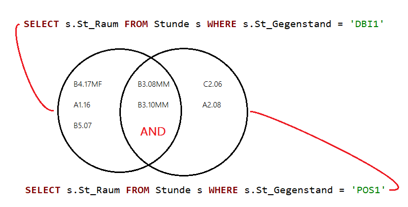

# Unterabfragen, die Listen liefern (IN, NOT IN)

Eine Liste ist hier ein Ergebnis, welches aus einer Spalte, aber mehreren Werten besteht. Wir
haben solche Listen bereits in Kombination mit dem *IN* Operator kennengelernt, nämlich indem
wir Stringlisten fix angegeben haben.

Die folgende Abfrage liefert alle Unterrichtsstunden, die in *DBI1*, *DBI1x* oder *DBI1y* abgehalten
werden.

```sql
SELECT *
FROM Stunde s
WHERE s.St_Gegenstand IN ('DBI1', 'DBI1x', 'DBI1y');
```

Die logische Bedeutung haben wir auch schon kennengelernt, denn die obere Abfrage entspricht einer
*OR* Verknüpfung aus den einzelnen Elementen der Liste.

```sql
SELECT *
FROM Stunde s
WHERE s.St_Gegenstand = 'DBI1' OR s.St_Gegenstand = 'DBI1x' OR s.St_Gegenstand = 'DBI1y';
```

> **Merke:** Der IN Operator prüft, ob ein Element in der angegebenen Liste vorkommt. Das zu
> prüfende Element und die Liste müssen den gleichen Typ haben. Er entspricht
> dem Existenzquantor in der Aussagenlogik und prüft, ob das Element in der Liste existiert.

## Unterabfragen mit IN

Wir können nicht nur fixe Werte, sondern auch Unterabfragen in IN angeben. Diese Abfragen dürfen
natürlich nur 1 Spalte, allerdings beliebig viele Werte zurückgeben.

Das folgende Beispiel ermittelt alle Räume, in denen unterrichtet wird. Dafür wird zuerst die
Liste der Räume abgefragt, in denen unterrichtet wird. Danach wird für jeden Raum geprüft, ob
er Element dieser Liste ist.


Natürlich kann man das Beispiel auch mit einem JOIN gelöst werden, allerdings wird dann jeder
Raum mehrfach angezeigt (1x pro Unterrichtsstunde). Erst die Gruppierung löst das Problem:

```sql
SELECT r.R_ID, r.R_Plaetze, r.R_Art
FROM Raum r INNER JOIN Stunde s ON (r.R_ID = s.St_Raum)
GROUP BY r.R_ID, r.R_Plaetze, r.R_Art;
```

Wir sehen, dass Unterabfragen oft intuitiver als die entsprechende JOIN Lösung zu lesen ist.

Folgendes Beispiel hat keine (einfache) Alternative als JOIN. Wir wollen nun wissen, in welchen
Räumen DBI1 **und** POS1 unterrichtet wird. Der erste Ansatz, den viele Studierende wählen,
führt zu keinem Ergebnis:

```sql
SELECT r.*
FROM Raum r INNER JOIN Stunde s ON (r.R_ID = s.St_Raum)
WHERE s.St_Gegenstand = 'DBI1' AND s.St_Gegenstand = 'POS1';
```

Das Ergebnis ist natürlich leer, denn keine Unterrichtsstunde ist zugleich DBI und POS. Die Lösung
führt über 2 Vergleiche mit IN:

```sql
SELECT *
FROM Raum r
WHERE
    r.R_ID IN (SELECT s.St_Raum FROM Stunde s WHERE s.St_Gegenstand = 'DBI1') AND
    r.R_ID IN (SELECT s.St_Raum FROM Stunde s WHERE s.St_Gegenstand = 'POS1');
```

Im Gegensatz zur vorigen Lösung werden hier 2 Mengen geschnitten. Die Menge der Räume, in denen
DBI1 unterrichtet wird und die Menge der Räume, in denen POS1 unterrichtet wird.



## NOT IN

Nun wollen wir die Räume wissen, in denen niemals DBI1 unterrichtet wird. Auch hier wählen viele
oft den falschen Ansatz mit einem JOIN und der Abfrage auf ungleich DBI:

```sql
SELECT r.*
FROM Raum r INNER JOIN Stunde s ON (r.R_ID = s.St_Raum)
WHERE s.St_Gegenstand <> 'DBI1';
```

Angenommen in einem Raum wird neben DBI1 auch AM unterrichtet. Dieser Raum würde in die Liste
aufgenommen, obwohl er auch eine DBI1 Stunde hat. Die korrekte Lösung führt zu *NOT IN*:

```sql
SELECT *
FROM Raum r
WHERE r.R_ID NOT IN (SELECT s.St_Raum FROM Stunde s WHERE s.St_Raum IS NOT NULL AND s.St_Gegenstand = 'DBI1');
```

> **Vorsicht:** Kommt NULL in der Liste vor, so liefert NOT IN auch den Wert NULL. Daher müssen diese
> Werte ausgeschlossen werden. Folgendes Beispiel zeigt das Verhalten von NULL Werten in Kombination
> mit *NOT IN*:

```sql
SELECT 1 WHERE 'A' IN ('A', NULL);     -- Liefert 1, denn A ist sicher in der Liste.
SELECT 1 WHERE 'B' NOT IN ('A', NULL); -- Liefert kein Ergebnis, denn B ist vielleicht der NULL Wert.
```

## Abfragen mit "für alle": ein bisschen Aussagenlogik.

Wir betrachten das folgende Beispiel: Welche Lehrer unterrichten nur in den HIF Klassen? Dafür
reicht das *IN* alleine nicht aus, denn es würde alle Lehrer liefern, die **unter anderem** eine
HIF Klasse unterrichten.

Wir formulieren das Problem daher um: *Ein Lehrer, der nur HIF Klassen unterrichtet* ist
gleichbedeutend mit der Aussage *Ein Lehrer, der keine nicht-HIF Klasse unterrichtet*. Diese
Umformulierung erlaubt es uns, wieder mit *IN* zu arbeiten, denn wir haben eine Existenzabfrage
vorliegen.

```sql
SELECT *
FROM Lehrer l
WHERE l.L_Nr NOT IN (SELECT s.St_Lehrer FROM Stunde s WHERE s.St_Klasse NOT LIKE '%HIF%');
```

> Abfragen, bei denen eine Eigenschaft für alle Elemente gelten muss, kann durch Negation des
> Prädikats und einer Negation der Gesamtaussage in ein Existenzproblem umgewandelt werden.

Nachfolgend wird die Bedeutung der möglichen Kombinationen dieser Abfrage beschrieben:

Liefert alle Lehrer, die **mindestens eine** HIF Klasse unterrichten.

```sql
SELECT *
FROM Lehrer l
WHERE l.L_Nr IN (SELECT s.St_Lehrer FROM Stunde s WHERE s.St_Klasse LIKE '%HIF%');
```

Liefert alle Lehrer, die **keine einzige** HIF Klasse unterrichten.

```sql
SELECT *
FROM Lehrer l
WHERE l.L_Nr NOT IN (SELECT s.St_Lehrer FROM Stunde s WHERE s.St_Klasse LIKE '%HIF%');
```

Liefert alle Lehrer, die **mindestens eine** nicht-HIF Klasse unterrichten.

```sql
SELECT *
FROM Lehrer l
WHERE l.L_Nr IN (SELECT s.St_Lehrer FROM Stunde s WHERE s.St_Klasse NOT LIKE '%HIF%');
```

## Übungen

Bearbeiten Sie die folgenden Abfragen. Die korrekte Lösung ist in der Tabelle darunter, die erste
Spalte (#) ist allerdings nur die Datensatznummer und kommt im Abfrageergebnis nicht vor. Die
Bezeichnung der Spalten, die Formatierung und die Sortierung muss nicht exakt übereinstimmen.
